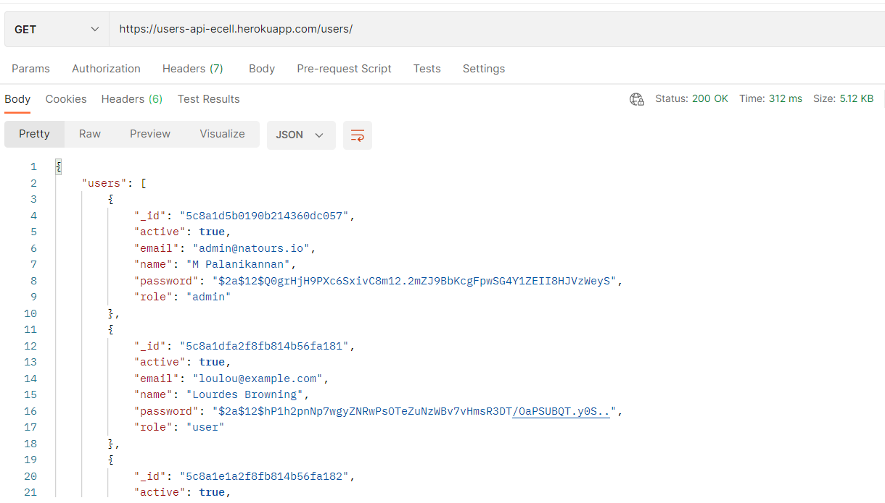
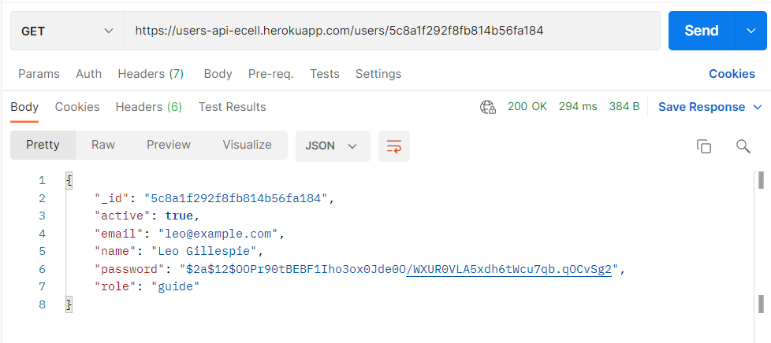
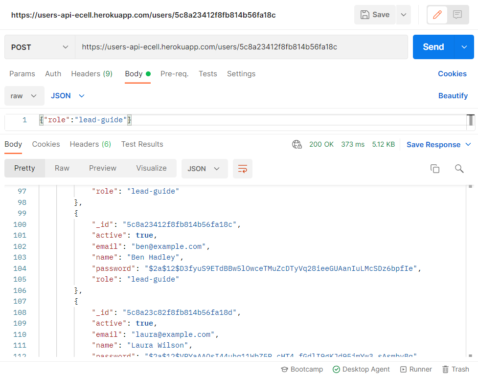
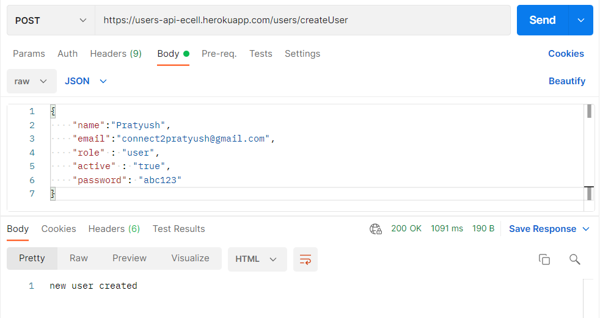
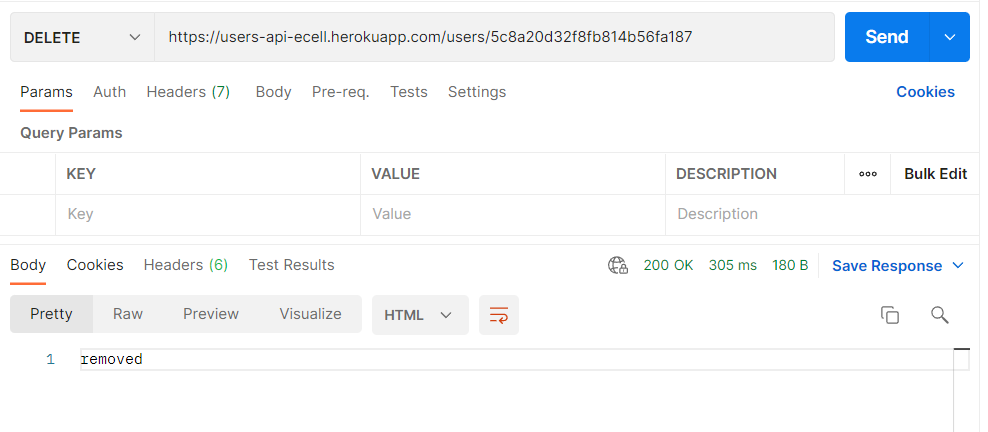

# UsersApiTask

A CRUD & REST api to query user data  
You can go to the deployed site here https://users-api-ecell.herokuapp.com/.

## Setup

First import all the python dependencies in your virtual environment by the following command `pip install -r requirements.txt`

You can run this api server by this `flask run` or `python -m run`

---

### Retrieving all users data

`GET /users/` will fetch all the users data.

### Get one users data

`GET /users/<userId>` will fetch the data of the user with given id.

### Update users data

`POST /users/<userId>` will update the data of user with the given id.

### Create new users data

`POST /users/createUser` will create a new user.

### Delete users data

`DELETE /users/<userId>` will delete the users data with the given id.

